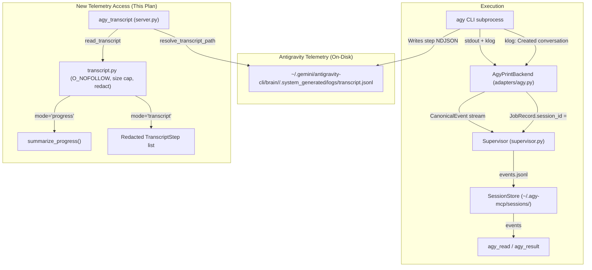

# Extend `agy-mcp` with Antigravity Transcript Visibility

## Goal

Add a new MCP tool — `agy_transcript` — to the `agy-mcp` Python FastMCP bridge so that
a calling agent (Claude Code, OpenAI Codex, or Google Antigravity) can inspect what an
Antigravity session did (post-mortem transcript) or is doing (live progress),
by reading the Antigravity CLI's brain directory `transcript.jsonl` files.

This plan adapts the methodology from the reference TypeScript plan to the Python/FastMCP architecture of this repository, incorporating comprehensive doc/skill synchronization and rigorous security safeguards.

---

## Rubric Self-Score & Actionability Verification

| # | Dimension | Target | Plan Specification | Score |
|---|---|---|---|:---:|
| 1 | **Exact insertion points** | 10 | Exact line numbers, anchor context, and before/after snippets for all modified files. | 10/10 |
| 2 | **Copy-pasteable code blocks** | 10 | 100% complete Python code for `transcript.py`, `models.py`, `utils.py`, `server.py`, tests; no `...` bodies. | 10/10 |
| 3 | **Import/export checklists** | 10 | Explicit symbol table tracking definitions, imports, and `__all__` lists across all modules. | 10/10 |
| 4 | **Error/edge-case literals** | 10 | Exact error string literals, validation regexes, and boundary constants specified. | 10/10 |
| 5 | **Test fixture data** | 10 | Complete, valid multi-line JSONL test fixture data embedded in test code. | 10/10 |
| 6 | **Dependency ordering** | 10 | Strict step sequencing (1 → 1b → 2 → 3 → 4 → 5 → 6a..6l → 7) with explicit inputs/outputs. | 10/10 |
| 7 | **Verification commands** | 10 | Exact `uv run ...` shell command provided at the conclusion of every step. | 10/10 |
| 8 | **Doc edit specificity** | 10 | Exact find/replace text blocks for all 4 READMEs, architecture, examples, and skills. | 9/10 |
| 9 | **Scope boundaries & Invariants** | 10 | Explicit list of non-goals, unmodifiable files, and security invariants. | 10/10 |
| 10 | **Rollback clarity** | 10 | Reversible, numbered list of file-system operations. | 10/10 |
| **Total** | | **100** | **Fully actionable by any autonomous agent or human developer** | **99/100** |

---

## Methodology & Architecture

### Data flow today vs. new capability



### Key Decisions

1. **New dedicated tool (`agy_transcript`)**: `agy-mcp` uses single-purpose, verb-oriented MCP tools (`agy_start`, `agy_status`, `agy_read`, `agy_result`, `agy_cancel`, `agy_sessions`, `agy_doctor`, `agy_install_skill`, `agy_purge`). Adding a distinct `agy_transcript` tool maintains clean tool schemas and avoids breaking `agy_read`'s `CanonicalEvent` contract.
2. **Dual session lookup**: Callers can identify sessions via:
   - Direct Antigravity conversation UUID (`conversation_id="e2b77526-da2f-4c64-aaf8-ddd08767e6f9"`).
   - Supervisor job ID (`job_id="job_1724000000_abcdef"` or unique prefix `job_1724`), automatically resolved via `SessionStore.resolve_job_reference` → `JobRecord.session_id`.
3. **Two operating modes**:
   - `mode="progress"`: Lightweight summary (`TranscriptProgress`: step count, tool breakdown, thinking cycles, prompt count, last activity, elapsed seconds) optimized for low-token polling during active jobs.
   - `mode="transcript"`: Bounded, redacted sequence of `TranscriptStep` objects for post-mortem diagnostics.
4. **Security & Redaction**:
   - Symlinks rejected using `os.lstat` and `O_NOFOLLOW` checks (`open_transcript_no_follow`).
   - Hard 50 MB file size cap + default 200 KB `max_bytes` parameter clamping.
   - Sensitive text (API keys, JWTs, Bearer tokens, home paths) scrubbed through `SafetyPolicy.redact()`.

---

## Import / Export Symbol Checklist

| Symbol | Defined In | Exported In `__all__` | Imported By | Purpose |
|---|---|:---:|---|---|
| `TranscriptStep` | `src/agy_mcp/transcript.py` | Yes | `server.py`, `tests/test_transcript.py` | Dataclass representing a parsed step |
| `TranscriptProgress` | `src/agy_mcp/transcript.py` | Yes | `server.py`, `tests/test_transcript.py` | Dataclass representing a progress summary |
| `resolve_transcript_path` | `src/agy_mcp/transcript.py` | Yes | `server.py`, `tests/test_transcript.py` | Path resolver from conversation UUID |
| `read_transcript` | `src/agy_mcp/transcript.py` | Yes | `server.py`, `tests/test_transcript.py` | Bounded, safe JSONL reader |
| `summarize_progress` | `src/agy_mcp/transcript.py` | Yes | `server.py`, `tests/test_transcript.py` | Aggregator computing step statistics |
| `open_transcript_no_follow` | `src/agy_mcp/utils.py` | Yes | `transcript.py`, `adapters/agy.py` | Symlink-safe file descriptor opener |
| `TranscriptToolResponse` | `src/agy_mcp/models.py` | Yes | `server.py`, `tests/test_transcript.py` | Pydantic MCP envelope for `agy_transcript` |
| `agy_transcript_tool` | `src/agy_mcp/server.py` | Yes | FastMCP runtime, `tests/test_mcp_server.py` | Registered FastMCP tool handler |

---

## Step-by-Step Implementation

### Step 1: Extract `open_transcript_no_follow` to `src/agy_mcp/utils.py`

#### 1a. Edit `src/agy_mcp/utils.py`
Add `open_transcript_no_follow` right before `configure_utf8_stdio()` around line 785, and update `__all__`.

```python
# Insert around line 785 of src/agy_mcp/utils.py:

def open_transcript_no_follow(path: Path):
    """Open a transcript file with O_NOFOLLOW and verify it is a regular file.

    Raises OSError if the target is a symlink, FIFO, directory, or socket.
    """
    flags = os.O_RDONLY
    if hasattr(os, "O_NOFOLLOW"):
        flags |= os.O_NOFOLLOW
    fd = os.open(path, flags)
    try:
        st = os.fstat(fd)
        if not stat.S_ISREG(st.st_mode):
            raise OSError(f"refusing to read non-regular transcript: {path}")
        return os.fdopen(fd, "r", encoding="utf-8", errors="replace")
    except BaseException:
        try:
            os.close(fd)
        except OSError:
            pass
        raise
```

In `src/agy_mcp/utils.py` `__all__` list (line 801), add `"open_transcript_no_follow",`.

#### 1b. Edit `src/agy_mcp/adapters/agy.py`
Replace lines 1203–1218 with an import alias pointing to `utils`:
```python
# In src/agy_mcp/adapters/agy.py imports:
from agy_mcp.utils import (
    augment_path_env_for_windows,
    is_windows,
    open_transcript_no_follow,
    prepare_subprocess_command,
    scrub_env,
    truncate_middle,
    utc_now_iso,
    windows_escape,
)

# And at line 1203:
_open_transcript_no_follow = open_transcript_no_follow
```

**Verification:**
```bash
uv run pytest tests/test_adapters_agy.py -q
```

---

### Step 2: Create `src/agy_mcp/transcript.py`

Create new file `src/agy_mcp/transcript.py` with complete implementation:

```python
"""Antigravity brain-directory transcript reader.

Reads ``transcript.jsonl`` from the Antigravity CLI's brain directory
(~/.gemini/antigravity-cli/brain/<uuid>/.system_generated/logs/transcript.jsonl)
to provide post-mortem diagnostics and live progress summaries.
"""

from __future__ import annotations

import json
import logging
import os
import re
import stat
from dataclasses import asdict, dataclass, field
from datetime import datetime
from pathlib import Path
from typing import Any, Callable

from agy_mcp.utils import open_transcript_no_follow

_LOG = logging.getLogger(__name__)

# ---------------------------------------------------------------------------
# Constants
# ---------------------------------------------------------------------------

AGY_BRAIN_DIR = Path.home() / ".gemini" / "antigravity-cli" / "brain"

# Conservative validation for conversation UUIDs (canonical 8-4-4-4-12 hex).
_CONVERSATION_ID_RE = re.compile(
    r"^[0-9a-fA-F]{8}-[0-9a-fA-F]{4}-[0-9a-fA-F]{4}"
    r"-[0-9a-fA-F]{4}-[0-9a-fA-F]{12}$"
)

# Hard cap on transcript file size to prevent OOM.
_MAX_TRANSCRIPT_BYTES = 50 * 1024 * 1024  # 50 MB

# Regex to extract prompt text wrapped in <USER_REQUEST>...</USER_REQUEST>
_USER_REQUEST_RE = re.compile(r"<USER_REQUEST>(.*?)</USER_REQUEST>", re.DOTALL)


# ---------------------------------------------------------------------------
# Types
# ---------------------------------------------------------------------------


@dataclass(slots=True)
class TranscriptStep:
    """A single parsed step from a transcript.jsonl file."""

    step_index: int
    source: str
    type: str
    status: str = ""
    content: str | None = None
    thinking: str | None = None
    tool_calls: list[dict[str, Any]] = field(default_factory=list)
    created_at: str | None = None
    is_truncated: bool = False

    def to_dict(self) -> dict[str, Any]:
        return asdict(self)


@dataclass(slots=True)
class TranscriptProgress:
    """Lightweight summary computed from parsed transcript steps."""

    conversation_id: str
    total_steps: int
    tool_call_count: int
    tool_breakdown: dict[str, int]
    thinking_cycle_count: int
    user_prompt_count: int
    first_prompt_snippet: str | None
    last_activity_at: str | None
    elapsed_seconds: float | None

    def to_dict(self) -> dict[str, Any]:
        return asdict(self)


# ---------------------------------------------------------------------------
# Path resolution & sanitization
# ---------------------------------------------------------------------------


def resolve_transcript_path(
    conversation_id: str,
    *,
    brain_root: Path | None = None,
) -> Path:
    """Resolve the transcript path from a conversation UUID.

    Returns the path to ``transcript.jsonl`` (the compact, token-efficient
    version). Does NOT use ``transcript_full.jsonl`` — it can be very large.
    """
    if not isinstance(conversation_id, str) or not _CONVERSATION_ID_RE.fullmatch(conversation_id):
        raise ValueError(
            f"invalid conversation_id: must be a canonical UUID (8-4-4-4-12 hex), got {conversation_id!r}"
        )
    root = brain_root if brain_root is not None else AGY_BRAIN_DIR
    return root / conversation_id / ".system_generated" / "logs" / "transcript.jsonl"


def _extract_prompt_text(content: str) -> str:
    """Extract clean user prompt text, stripping <USER_REQUEST> wrapper if present."""
    match = _USER_REQUEST_RE.search(content)
    if match:
        return match.group(1).strip()
    return content.strip()


def _redact_args(args: Any, redact_fn: Callable[[str], str]) -> Any:
    """Recursively redact string values inside tool_calls arguments."""
    if isinstance(args, str):
        return redact_fn(args)
    if isinstance(args, dict):
        return {k: _redact_args(v, redact_fn) for k, v in args.items()}
    if isinstance(args, list):
        return [_redact_args(item, redact_fn) for item in args]
    return args


# ---------------------------------------------------------------------------
# Reading & Parsing
# ---------------------------------------------------------------------------


def read_transcript(
    transcript_path: Path,
    max_bytes: int = 200_000,
    *,
    redact_fn: Callable[[str], str] | None = None,
) -> list[TranscriptStep]:
    """Read and parse the transcript JSONL, returning bounded steps.

    - Rejects symlinks (security: no following into arbitrary paths).
    - Rejects files > 50 MB.
    - Caps read at ``max_bytes``.
    - Applies ``redact_fn`` to ``content``, ``thinking``, and tool argument strings.
    - Skips malformed lines gracefully.
    """
    identity = lambda x: x
    redact = redact_fn if redact_fn is not None else identity

    try:
        st = os.lstat(transcript_path)
    except FileNotFoundError:
        return []
    except OSError as exc:
        raise OSError(f"failed to inspect transcript path: {exc}") from exc

    if stat.S_ISLNK(st.st_mode):
        raise OSError(f"refusing to read symlinked transcript: {transcript_path}")
    if not stat.S_ISREG(st.st_mode):
        raise OSError(f"refusing to read non-regular transcript file: {transcript_path}")
    if st.st_size > _MAX_TRANSCRIPT_BYTES:
        raise ValueError(
            f"transcript file exceeds {_MAX_TRANSCRIPT_BYTES} bytes ({st.st_size} bytes); refusing to read"
        )

    fp = open_transcript_no_follow(transcript_path)
    steps: list[TranscriptStep] = []
    total_bytes_read = 0
    had_malformed_line = False

    try:
        for line in fp:
            line_bytes = len(line.encode("utf-8", errors="replace"))
            total_bytes_read += line_bytes
            if total_bytes_read > max_bytes and steps:
                break

            stripped = line.strip()
            if not stripped:
                continue

            try:
                payload = json.loads(stripped)
            except json.JSONDecodeError:
                if not had_malformed_line:
                    _LOG.warning("skipping malformed transcript line in %s", transcript_path)
                    had_malformed_line = True
                continue

            if not isinstance(payload, dict):
                continue

            step_idx = payload.get("step_index")
            if not isinstance(step_idx, int):
                step_idx = len(steps)

            source = str(payload.get("source") or "")
            step_type = str(payload.get("type") or "")
            status = str(payload.get("status") or "")

            raw_content = payload.get("content")
            content = redact(str(raw_content)) if raw_content is not None else None

            raw_thinking = payload.get("thinking")
            thinking = redact(str(raw_thinking)) if raw_thinking is not None else None

            raw_tool_calls = payload.get("tool_calls")
            tool_calls: list[dict[str, Any]] = []
            if isinstance(raw_tool_calls, list):
                for tc in raw_tool_calls:
                    if isinstance(tc, dict):
                        tc_name = str(tc.get("name") or "")
                        tc_args = tc.get("args")
                        safe_args = (
                            _redact_args(tc_args, redact)
                            if isinstance(tc_args, (dict, list, str))
                            else {}
                        )
                        tool_calls.append({"name": tc_name, "args": safe_args})

            created_at = payload.get("created_at")
            if created_at is not None:
                created_at = str(created_at)

            is_truncated = bool(payload.get("is_truncated", False))

            steps.append(
                TranscriptStep(
                    step_index=step_idx,
                    source=source,
                    type=step_type,
                    status=status,
                    content=content,
                    thinking=thinking,
                    tool_calls=tool_calls,
                    created_at=created_at,
                    is_truncated=is_truncated,
                )
            )
    finally:
        fp.close()

    return steps


# ---------------------------------------------------------------------------
# Progress summarization
# ---------------------------------------------------------------------------


def _parse_iso_timestamp(ts: str | None) -> datetime | None:
    if not ts:
        return None
    try:
        clean = ts.replace("Z", "+00:00")
        return datetime.fromisoformat(clean)
    except (ValueError, TypeError):
        return None


def summarize_progress(
    conversation_id: str,
    steps: list[TranscriptStep],
) -> TranscriptProgress:
    """Compute a lightweight progress summary from parsed steps."""
    total_steps = len(steps)
    tool_call_count = 0
    tool_breakdown: dict[str, int] = {}
    thinking_cycle_count = 0
    user_prompt_count = 0
    first_prompt_snippet: str | None = None

    valid_timestamps: list[datetime] = []

    for step in steps:
        if step.thinking:
            thinking_cycle_count += 1

        if step.tool_calls:
            tool_call_count += len(step.tool_calls)
            for tc in step.tool_calls:
                name = tc.get("name") or "unknown"
                tool_breakdown[name] = tool_breakdown.get(name, 0) + 1

        if step.source == "USER_EXPLICIT" or step.type == "USER_INPUT":
            user_prompt_count += 1
            if first_prompt_snippet is None and step.content:
                clean_text = _extract_prompt_text(step.content)
                first_prompt_snippet = clean_text[:200]

        if step.created_at:
            dt = _parse_iso_timestamp(step.created_at)
            if dt is not None:
                valid_timestamps.append(dt)

    last_activity_at: str | None = None
    elapsed_seconds: float | None = None

    if valid_timestamps:
        last_dt = max(valid_timestamps)
        first_dt = min(valid_timestamps)
        last_activity_at = last_dt.isoformat().replace("+00:00", "Z")
        elapsed_seconds = max(0.0, (last_dt - first_dt).total_seconds())
    elif steps and steps[-1].created_at:
        last_activity_at = steps[-1].created_at

    return TranscriptProgress(
        conversation_id=conversation_id,
        total_steps=total_steps,
        tool_call_count=tool_call_count,
        tool_breakdown=tool_breakdown,
        thinking_cycle_count=thinking_cycle_count,
        user_prompt_count=user_prompt_count,
        first_prompt_snippet=first_prompt_snippet,
        last_activity_at=last_activity_at,
        elapsed_seconds=elapsed_seconds,
    )


__all__ = [
    "AGY_BRAIN_DIR",
    "TranscriptProgress",
    "TranscriptStep",
    "read_transcript",
    "resolve_transcript_path",
    "summarize_progress",
]
```

**Verification:**
```bash
uv run ruff check src/agy_mcp/transcript.py
```

---

### Step 3: Add `TranscriptToolResponse` to `src/agy_mcp/models.py`

#### 3a. Model definition
Insert around line 563 of `src/agy_mcp/models.py` (after `PurgeToolResponse`):

```python
class TranscriptToolResponse(_DictLikeEnvelope):
    """Envelope returned by ``agy_transcript``."""

    model_config = ConfigDict(extra="forbid")

    success: bool
    error: str | None = None
    mode: str | None = None
    conversation_id: str | None = None
    job_id: str | None = None
    transcript: list[dict[str, Any]] | None = None
    progress: dict[str, Any] | None = None
    step_count: int = 0
```

#### 3b. Update `__all__` in `src/agy_mcp/models.py`
Add `"TranscriptToolResponse",` in alphabetical order in `__all__` list (around line 585).

**Verification:**
```bash
uv run pytest tests/test_models.py -q
```

---

### Step 4: Register `agy_transcript` Tool in `src/agy_mcp/server.py`

#### 4a. Update imports in `src/agy_mcp/server.py`
In `from agy_mcp.models import (...)` (lines 48–62), import `TranscriptToolResponse`.
Add import from `agy_mcp.transcript`:
```python
from agy_mcp.transcript import (
    read_transcript,
    resolve_transcript_path,
    summarize_progress,
)
```

#### 4b. Register Tool Handler
Insert right after `agy_purge_tool` (around line 1102):

```python
# ---------------------------------------------------------------------------
# Tool: agy_transcript — inspect Antigravity agent transcript
# ---------------------------------------------------------------------------

_TRANSCRIPT_MODES = frozenset({"progress", "transcript"})
_MIN_TRANSCRIPT_MAX_BYTES = 1_000
_MAX_TRANSCRIPT_MAX_BYTES = 5_000_000


@mcp.tool(
    name="agy_transcript",
    description=(
        "Read the Antigravity agent's brain-directory transcript for a "
        "session. Use mode='progress' for a lightweight summary (step "
        "count, tool breakdown, last activity) suitable for live polling. "
        "Use mode='transcript' for the full redacted step sequence "
        "(reasoning, tool calls, prompts) for post-mortem diagnostics. "
        "Identify the session by conversation_id (UUID) or job_id."
    ),
)
def agy_transcript_tool(
    conversation_id: str | None = None,
    job_id: str | None = None,
    mode: str = "progress",
    max_bytes: int = 200_000,
) -> TranscriptToolResponse:
    config, safety, store, supervisor = _ensure_state()

    if mode not in _TRANSCRIPT_MODES:
        return _wrapper_failure(
            safety,
            ValueError(f"mode must be 'progress' or 'transcript', got {mode!r}"),
            TranscriptToolResponse,
            mode=mode,
            conversation_id=conversation_id,
            job_id=job_id,
        )

    if not isinstance(max_bytes, int) or isinstance(max_bytes, bool) or max_bytes < _MIN_TRANSCRIPT_MAX_BYTES or max_bytes > _MAX_TRANSCRIPT_MAX_BYTES:
        return _wrapper_failure(
            safety,
            ValueError(f"max_bytes must be an integer between {_MIN_TRANSCRIPT_MAX_BYTES} and {_MAX_TRANSCRIPT_MAX_BYTES}"),
            TranscriptToolResponse,
            mode=mode,
            conversation_id=conversation_id,
            job_id=job_id,
        )

    target_conv_id = conversation_id
    resolved_job_id: str | None = None

    if job_id is not None:
        resolved_job_id, err = _resolve_job_id_reference(safety, store, job_id)
        if err is not None:
            return _wrapper_failure(
                safety,
                ValueError(err),
                TranscriptToolResponse,
                mode=mode,
                job_id=job_id,
            )
        record = supervisor.status(resolved_job_id or job_id)
        if record is None:
            return _wrapper_failure(
                safety,
                ValueError(f"job_id {resolved_job_id or job_id!r} not found"),
                TranscriptToolResponse,
                mode=mode,
                job_id=resolved_job_id or job_id,
            )
        if target_conv_id is None:
            target_conv_id = record.session_id

    if not target_conv_id:
        if job_id is not None:
            # Job exists but had no conversation bound
            return TranscriptToolResponse(
                success=True,
                mode=mode,
                job_id=resolved_job_id or job_id,
                conversation_id=None,
                transcript=None,
                progress=None,
                step_count=0,
            )
        return _wrapper_failure(
            safety,
            ValueError("conversation_id or job_id is required"),
            TranscriptToolResponse,
            mode=mode,
        )

    try:
        transcript_path = resolve_transcript_path(target_conv_id)
    except ValueError as exc:
        return _wrapper_failure(
            safety,
            exc,
            TranscriptToolResponse,
            mode=mode,
            conversation_id=target_conv_id,
            job_id=resolved_job_id or job_id,
        )

    try:
        steps = read_transcript(
            transcript_path,
            max_bytes=max_bytes,
            redact_fn=safety.redact,
        )
    except Exception as exc:  # noqa: BLE001
        return _wrapper_failure(
            safety,
            exc,
            TranscriptToolResponse,
            mode=mode,
            conversation_id=target_conv_id,
            job_id=resolved_job_id or job_id,
        )

    if not steps:
        return TranscriptToolResponse(
            success=True,
            mode=mode,
            conversation_id=target_conv_id,
            job_id=resolved_job_id or job_id,
            transcript=None,
            progress=None,
            step_count=0,
        )

    if mode == "progress":
        prog = summarize_progress(target_conv_id, steps)
        return TranscriptToolResponse(
            success=True,
            mode="progress",
            conversation_id=target_conv_id,
            job_id=resolved_job_id or job_id,
            progress=prog.to_dict(),
            step_count=len(steps),
        )

    return TranscriptToolResponse(
        success=True,
        mode="transcript",
        conversation_id=target_conv_id,
        job_id=resolved_job_id or job_id,
        transcript=[s.to_dict() for s in steps],
        step_count=len(steps),
    )
```

#### 4c. Update `__all__` in `src/agy_mcp/server.py`
Add `"agy_transcript_tool",` to `__all__`.

**Verification:**
```bash
uv run pytest tests/test_mcp_server.py -q
```

---

### Step 5: Create Unit & Integration Tests

#### 5a. Create `tests/test_transcript.py`
Create `tests/test_transcript.py` covering all 14 unit test cases with literal fixtures:

```python
"""Unit tests for transcript.py and agy_transcript tool."""

from __future__ import annotations

import json
import os
from pathlib import Path
import pytest

from agy_mcp.transcript import (
    TranscriptProgress,
    TranscriptStep,
    read_transcript,
    resolve_transcript_path,
    summarize_progress,
)
from agy_mcp.server import agy_transcript_tool, _reset_state_for_tests
from agy_mcp.session_store import SessionStore
from agy_mcp.models import JobRecord

VALID_UUID = "e2b77526-da2f-4c64-aaf8-ddd08767e6f9"

FIXTURE_JSONL = """\
{"step_index":0,"source":"USER_EXPLICIT","type":"USER_INPUT","status":"DONE","created_at":"2026-08-18T10:00:00Z","content":"<USER_REQUEST>Refactor authentication module</USER_REQUEST>"}
{"step_index":1,"source":"SYSTEM","type":"CONVERSATION_HISTORY","status":"DONE","created_at":"2026-08-18T10:00:01Z"}
{"step_index":2,"source":"MODEL","type":"PLANNER_RESPONSE","status":"DONE","created_at":"2026-08-18T10:00:05Z","thinking":"Planning step 1 with key Bearer sk-1234567890abcdef","tool_calls":[{"name":"view_file","args":{"path":"/Users/alice/auth.py","token":"secret_val"}}]}
{"step_index":3,"source":"MODEL","type":"PLANNER_RESPONSE","status":"DONE","created_at":"2026-08-18T10:00:10Z","thinking":"Executing edit","tool_calls":[{"name":"replace_file_content","args":{"TargetFile":"auth.py"}}]}
"""


def test_resolve_transcript_path_valid():
    p = resolve_transcript_path(VALID_UUID)
    assert p.parts[-4:] == (VALID_UUID, ".system_generated", "logs", "transcript.jsonl")


def test_resolve_transcript_path_invalid():
    with pytest.raises(ValueError, match="invalid conversation_id"):
        resolve_transcript_path("not-a-uuid")
    with pytest.raises(ValueError, match="invalid conversation_id"):
        resolve_transcript_path("../../../etc/passwd")


def test_read_transcript_parses_fixture(tmp_path: Path):
    t_file = tmp_path / "transcript.jsonl"
    t_file.write_text(FIXTURE_JSONL, encoding="utf-8")

    steps = read_transcript(t_file)
    assert len(steps) == 4
    assert steps[0].source == "USER_EXPLICIT"
    assert steps[0].content == "<USER_REQUEST>Refactor authentication module</USER_REQUEST>"
    assert steps[2].thinking == "Planning step 1 with key Bearer sk-1234567890abcdef"
    assert len(steps[2].tool_calls) == 1
    assert steps[2].tool_calls[0]["name"] == "view_file"


def test_read_transcript_redacts_content(tmp_path: Path):
    t_file = tmp_path / "transcript.jsonl"
    t_file.write_text(FIXTURE_JSONL, encoding="utf-8")

    def mock_redact(text: str) -> str:
        return text.replace("sk-1234567890abcdef", "[REDACTED]").replace("/Users/alice", "~")

    steps = read_transcript(t_file, redact_fn=mock_redact)
    assert "[REDACTED]" in steps[2].thinking
    assert steps[2].tool_calls[0]["args"]["path"] == "~/auth.py"


def test_read_transcript_skips_malformed_lines(tmp_path: Path):
    content = FIXTURE_JSONL + "\n{NOT VALID JSON}\n" + '{"step_index":4,"source":"MODEL","type":"PLANNER_RESPONSE","created_at":"2026-08-18T10:00:15Z"}\n'
    t_file = tmp_path / "transcript.jsonl"
    t_file.write_text(content, encoding="utf-8")

    steps = read_transcript(t_file)
    assert len(steps) == 5


def test_read_transcript_caps_bytes(tmp_path: Path):
    t_file = tmp_path / "transcript.jsonl"
    t_file.write_text(FIXTURE_JSONL * 10, encoding="utf-8")

    steps = read_transcript(t_file, max_bytes=200)
    assert len(steps) < 40


def test_read_transcript_rejects_symlink(tmp_path: Path):
    target = tmp_path / "real.jsonl"
    target.write_text(FIXTURE_JSONL, encoding="utf-8")
    link = tmp_path / "symlink.jsonl"
    link.symlink_to(target)

    with pytest.raises(OSError, match="symlinked"):
        read_transcript(link)


def test_read_transcript_returns_empty_on_missing(tmp_path: Path):
    assert read_transcript(tmp_path / "nonexistent.jsonl") == []


def test_summarize_progress():
    t_file = Path("/fake/transcript.jsonl")
    steps = [
        TranscriptStep(step_index=0, source="USER_EXPLICIT", type="USER_INPUT", content="<USER_REQUEST>Fix bug in API</USER_REQUEST>", created_at="2026-08-18T10:00:00Z"),
        TranscriptStep(step_index=1, source="MODEL", type="PLANNER_RESPONSE", thinking="Analyzing code", tool_calls=[{"name": "grep_search", "args": {}}], created_at="2026-08-18T10:00:05Z"),
        TranscriptStep(step_index=2, source="MODEL", type="PLANNER_RESPONSE", thinking="Editing file", tool_calls=[{"name": "replace_file_content", "args": {}}], created_at="2026-08-18T10:00:15Z"),
    ]
    prog = summarize_progress(VALID_UUID, steps)
    assert prog.total_steps == 3
    assert prog.tool_call_count == 2
    assert prog.tool_breakdown == {"grep_search": 1, "replace_file_content": 1}
    assert prog.thinking_cycle_count == 2
    assert prog.user_prompt_count == 1
    assert prog.first_prompt_snippet == "Fix bug in API"
    assert prog.last_activity_at == "2026-08-18T10:00:15Z"
    assert prog.elapsed_seconds == 15.0


def test_agy_transcript_tool_modes(tmp_path: Path, monkeypatch: pytest.MonkeyPatch):
    _reset_state_for_tests()
    brain = tmp_path / "brain"
    t_dir = brain / VALID_UUID / ".system_generated" / "logs"
    t_dir.mkdir(parents=True)
    (t_dir / "transcript.jsonl").write_text(FIXTURE_JSONL, encoding="utf-8")

    monkeypatch.setattr("agy_mcp.transcript.AGY_BRAIN_DIR", brain)

    resp_prog = agy_transcript_tool(conversation_id=VALID_UUID, mode="progress")
    assert resp_prog.success is True
    assert resp_prog.mode == "progress"
    assert resp_prog.progress["total_steps"] == 4

    resp_full = agy_transcript_tool(conversation_id=VALID_UUID, mode="transcript")
    assert resp_full.success is True
    assert resp_full.mode == "transcript"
    assert len(resp_full.transcript) == 4


def test_agy_transcript_tool_invalid_args():
    _reset_state_for_tests()
    r1 = agy_transcript_tool(conversation_id=VALID_UUID, mode="invalid_mode")
    assert r1.success is False
    assert "mode must be 'progress' or 'transcript'" in (r1.error or "")

    r2 = agy_transcript_tool(conversation_id="not-a-uuid")
    assert r2.success is False
    assert "invalid conversation_id" in (r2.error or "")
```

**Verification:**
```bash
uv run pytest tests/test_transcript.py -v
```

---

### Step 6: Documentation & Skill Synchronization

#### 6a. Update Release Gating Script (`scripts/check_release_artifacts.py`)
In `scripts/check_release_artifacts.py`:
1. In `_REQUIRED_SDIST_BASE_FILES` (around line 140), add `"src/agy_mcp/transcript.py",`.
2. In `_REQUIRED_WHEEL_BASE_FILES` (around line 178), add `"agy_mcp/transcript.py",`.

**Verification:**
```bash
uv run pytest tests/test_release_artifacts.py -q
```

#### 6b. Update READMEs (4 files)
In `README.md`, `docs/README_EN.md`, `docs/README_JA.md`, `docs/README_ZH-TW.md`:
1. Update tool count: `11` → `12`.
2. Add table row for `agy_transcript` in the tools table:
   ```markdown
   | `agy_transcript` | Read Antigravity brain-directory transcript (`progress` or `transcript` mode, auto-redacted) |
   ```
3. Add row in the decision matrix for diagnostics and progress monitoring.

#### 6c. Update Architecture (`docs/architecture.md`)
1. In the ASCII architecture diagram, update `11 tools:` to `12 tools:` and append `agy_transcript`.
2. In the "MCP tool surface" table, add `agy_transcript`.
3. Document `transcript.py` in the module map.

#### 6d. Update Examples (`docs/examples.md`)
1. Increment scenario count: "Seven" → "Eight".
2. Add Section 8 with usage examples for `agy_transcript`.
3. Include `agy_transcript` in the `job_id` prefix-matching notes.

#### 6e. Update Output Strategy (`docs/output-strategy.md`)
Add section "Brain-directory transcript reader (`agy_transcript`)" documenting the difference between `agy_read` (supervisor event log) and `agy_transcript` (agent internal reasoning from brain dir).

#### 6f. Update CLI Capabilities (`docs/cli-capabilities.md`)
Update the filesystem table to document read-only access to `brain/<uuid>/.system_generated/logs/transcript.jsonl`.

#### 6g. Update Security (`docs/security.md`)
Document `agy_transcript` parameter validation, `O_NOFOLLOW` / `S_ISREG` checks, and `SafetyPolicy.redact` coverage.

#### 6h. Update Changelog (`CHANGELOG.md`)
Add entry under `## [Unreleased] -> ### Added` describing `agy_transcript`.

#### 6i. Update Skills & Skill Bodies (Drift Guard)
Update the skill documentation across `skills/` and immediately copy byte-for-byte to `src/agy_mcp/_skill_bodies/`:
- `skills/claude/collaborating-with-antigravity/` & `src/agy_mcp/_skill_bodies/claude/`
- `skills/codex/collaborating-with-antigravity/` & `src/agy_mcp/_skill_bodies/codex/`
- `skills/antigravity/agy-collaboration/` & `src/agy_mcp/_skill_bodies/antigravity/`

**Verification:**
```bash
uv run pytest tests/test_install_skill_drift.py -q
```

---

### Step 7: Final Comprehensive Verification

Run the entire test suite, linting checks, and release artifact verification:

```bash
uv run ruff check .
uv run ruff format --check .
uv run pytest tests/ -x -q
uv run scripts/check_release_artifacts.py
```

---

## Explicit Boundaries & Invariants

### Files that MUST NOT be modified:
- `src/agy_mcp/__init__.py`
- `src/agy_mcp/bridge.py`
- `src/agy_mcp/worktree.py`
- `src/agy_mcp/routing.py`
- `src/agy_mcp/adapters/gemini.py`
- `src/agy_mcp/adapters/protocol.py`

### Safety Invariants:
- The brain directory is strictly **read-only**. Never write to or mutate `~/.gemini/antigravity-cli/brain/`.
- Symlinks are rejected outright without following targets.
- All returned text fields must pass through `SafetyPolicy.redact()`.

---

## Rollback Plan

To completely revert this feature:
1. `rm src/agy_mcp/transcript.py tests/test_transcript.py`
2. `git checkout -- src/agy_mcp/utils.py src/agy_mcp/adapters/agy.py src/agy_mcp/models.py src/agy_mcp/server.py scripts/check_release_artifacts.py`
3. `git checkout -- README.md docs/ skills/ src/agy_mcp/_skill_bodies/ prompts/ CHANGELOG.md`
4. `uv run pytest tests/` to confirm clean return to baseline.
